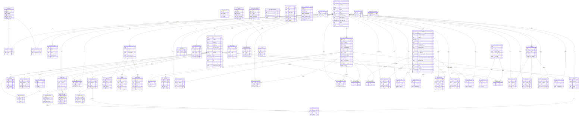

# ESG Mobile Database Schema

```mermaid
erDiagram
    %% User Management
    user {
        string id PK
        string username
        datetime created_at
        UserType type
        string birthdate
        string email
        string phone
        boolean email_verified
        datetime admin_approval_date
        string admin_approved_by
        string default_shipping_address
        VendorAdminType vendor_admin_type
        string company
        string department
        boolean is_employee
    }

    organization {
        string id PK
        string name
        string description
        string logo_bucket
        string logo_folder_path
        string logo_file_name
    }

    company {
        string id PK
        string name
        string description
        string logo_bucket
        string logo_folder_path
        string logo_file_name
    }

    department {
        string id PK
        string name
        string organization
    }

    user_organization {
        string user_id PK,FK
        string organization_id PK,FK
        string role
    }

    user_shipping_address {
        string id PK
        string user_id FK
        string recipient_name
        string phone
        string address
        string detailed_address
        boolean is_default
    }

    %% E-commerce
    product {
        string id PK
        datetime created_at
        string created_by FK
        string product_by
        string category FK
        double regular_price
        string main_image_bucket
        string main_image_folder_path
        string main_image_file_name
        string description
        ProductMaterial type
        ProductStyle style
        VendorAdminType vendor
        string name
        string title
        string company
        boolean is_curation
        double additional_discount_rate
        boolean is_listed
    }

    product_category {
        string id PK
        string name
        string parent_category
        int order
    }

    product_subcategory {
        string id PK
        string name
        string category FK
        int order
    }

    product_image {
        string id PK
        string product_id FK
        string bucket
        string folder_path
        string file_name
        int order
    }

    product_option_color {
        string id PK
        string product_id FK
        string name
        string hex_code
        double additional_price
    }

    product_option_parameter {
        string id PK
        string product_id FK
        string name
        string value
        double additional_price
    }

    product_option_value {
        string id PK
        string parameter_id FK
        string value
        double additional_price
    }

    product_review {
        string id PK
        string product_id FK
        string reviewer FK
        int rating
        string title
        string content
        datetime created_at
    }

    product_review_image {
        string id PK
        string review_id FK
        string bucket
        string folder_path
        string file_name
    }

    product_wishlist {
        string user_id PK,FK
        string product_id PK,FK
        datetime added_at
    }

    cart_item {
        string id PK
        datetime created_at
        double quantity
        string customer FK
        string product FK
        string option_color FK
    }

    cart_item_option {
        string id PK
        string cart_item_id FK
        string parameter_id FK
        string value_id FK
    }

    order {
        string id PK
        datetime created_at
        string order_by FK
        string shipping_address FK
        string payment FK
        double award_points_used
        string transaction_reference
    }

    order_item {
        string id PK
        string order_id FK
        string product_id FK
        double quantity
        double unit_price
        string option_color FK
    }

    order_item_option {
        string id PK
        string order_item_id FK
        string parameter_id FK
        string value_id FK
    }

    payment {
        string id PK
        datetime created_at
        string order_id FK
        double amount
        string method
        string status
        string transaction_id
    }

    shipping_address {
        string id PK
        string user_id FK
        string recipient_name
        string phone
        string address
        string detailed_address
        boolean is_default
    }

    %% Content Management (Stories)
    story {
        string id PK
        datetime created_at
        string created_by FK
        string title
        string subtitle
        string thumbnail_bucket
        string thumbnail_folder_path
        string thumbnail_file_name
        string content
        string place_name
        string detailed_address
        string seo_title
        string seo_keywords
        string seo_description
        string seo_url
        boolean is_published
        boolean is_deleted
    }

    story_tag {
        string id PK
        string story_id FK
        string tag
    }

    story_photo {
        string id PK
        string story_id FK
        string bucket
        string folder_path
        string file_name
        int order
    }

    story_comment {
        string id PK
        datetime created_at
        string story_id FK
        string comment_by FK
        string comment
    }

    story_like {
        string story_id PK,FK
        string user_id PK,FK
        datetime liked_at
    }

    story_blocked {
        string story PK,FK
        string blocker FK
        datetime created_at
    }

    story_related_product {
        string story_id PK,FK
        string product_id PK,FK
    }

    story_related_mission {
        string story_id PK,FK
        string mission_id PK,FK
    }

    %% Missions & Environmental
    mission {
        string id PK
        string do_not_do_explanation
        datetime created_at
        string created_by FK
        MissionType type
        string title
        string text
        string thumbnail_bucket
        string thumbnail_folder_path
        string thumbnail_filename
        int award_points
        int order
        string task_explanation
        string participation_button_text
        string name
        double carbon_emissions_reduction_per_participation_g
        string start_active_date
        string last_active_date
        MissionPublicity publicity
        boolean is_published
        string stamp
        double budget_limit
        string company_id FK
        double cost
        boolean is_deleted
    }

    mission_participation {
        string id PK
        string mission_id FK
        string participant FK
        datetime participated_at
        string status
    }

    mission_click {
        string id PK
        string mission_id FK
        string user_id FK
        datetime clicked_at
    }

    mission_impression {
        string id PK
        string mission_id FK
        string user_id FK
        datetime impressed_at
    }

    mission_photo_task {
        string id PK
        string mission_id FK
        string user_id FK
        string bucket
        string folder_path
        string file_name
        datetime uploaded_at
    }

    mission_request {
        string id PK
        string mission_id FK
        string requested_by FK
        datetime requested_at
        string status
    }

    %% Awards & Points
    award_points {
        string id PK
        string user_id FK
        double balance
        datetime last_updated
    }

    award_points_transaction {
        string id PK
        string user_id FK
        double amount
        string type
        string reference_id
        string description
        datetime created_at
    }

    stamp {
        string id PK
        string user_id FK
        string mission_id FK
        datetime earned_at
    }

    %% Lookbooks
    lookbook {
        string id PK
        string title
        string description
        string thumbnail_bucket
        string thumbnail_folder_path
        string thumbnail_file_name
        boolean is_published
        datetime created_at
    }

    lookbook_entry {
        string id PK
        string lookbook_id FK
        string product_id FK
        int order
    }

    lookbook_product {
        string lookbook_id PK,FK
        string product_id PK,FK
    }

    %% Notifications
    push_notification {
        string id PK
        string user_id FK
        string title
        string body
        string data
        boolean read
        datetime created_at
    }

    push_notification_token {
        string id PK
        string user_id FK
        string token
        string platform
        datetime created_at
    }

    automatic_push_notification {
        string id PK
        string title
        string body
        string target_audience
        datetime scheduled_at
        boolean sent
    }

    client_admin_notification {
        string id PK
        string title
        string content
        ClientAdminNotificationType type
        datetime created_at
    }

    %% Popups
    popup {
        string id PK
        string title
        string content
        string image_bucket
        string image_folder_path
        string image_file_name
        boolean is_active
        datetime start_date
        datetime end_date
    }

    automatic_popup {
        string id PK
        string title
        string content
        string image_bucket
        string image_folder_path
        string image_file_name
        string trigger_condition
        boolean is_active
    }

    automatic_popup_category {
        string id PK
        string name
        string description
    }

    %% Customer Support
    inquiry {
        string id PK
        datetime created_at
        string created_by FK
        string content
        string title
        boolean has_response
    }

    inquiry_comment {
        string id PK
        string inquiry_id FK
        string author FK
        string content
        datetime created_at
    }

    inquiry_response {
        string id PK
        string inquiry_id FK
        string responder FK
        string content
        datetime created_at
    }

    inquiry_audit_log {
        string id PK
        string inquiry_id FK
        string action
        string performed_by FK
        datetime performed_at
    }

    faq {
        string id PK
        string title
        string content
        string category FK
        int order
    }

    faq_category {
        string id PK
        string name
        string description
        int order
    }

    %% Reporting & Moderation
    report {
        string id PK
        datetime created_at
        string reporter FK
        string story_reported FK
    }

    %% Settings & Configuration
    setting {
        string key PK
        string value
        string description
    }

    integrated_admin_preferences {
        string user_id PK,FK
        string preferences
    }

    %% Relationships
    user ||--o{ user_organization : belongs_to
    organization ||--o{ user_organization : has
    user ||--o{ user_shipping_address : has
    user ||--o{ department : belongs_to
    organization ||--o{ department : has

    user ||--o{ product : creates
    user ||--o{ story : creates
    user ||--o{ mission : creates
    user ||--o{ inquiry : creates

    product_category ||--o{ product_subcategory : has
    product ||--o{ product_category : belongs_to
    product ||--o{ product_subcategory : belongs_to
    product ||--o{ product_image : has
    product ||--o{ product_option_color : has
    product ||--o{ product_option_parameter : has
    product_option_parameter ||--o{ product_option_value : has

    product ||--o{ product_review : has
    product_review ||--o{ product_review_image : has
    user ||--o{ product_review : writes
    user ||--o{ product_wishlist : has
    product ||--o{ product_wishlist : wished_by

    user ||--o{ cart_item : has
    product ||--o{ cart_item : in_cart_of
    cart_item ||--o{ cart_item_option : has
    product_option_parameter ||--o{ cart_item_option : selected_in
    product_option_value ||--o{ cart_item_option : selected_in

    user ||--o{ order : places
    order ||--o{ order_item : contains
    product ||--o{ order_item : ordered_in
    order_item ||--o{ order_item_option : has
    order ||--o{ payment : paid_by
    order ||--o{ shipping_address : ships_to

    story ||--o{ story_tag : has
    story ||--o{ story_photo : has
    story ||--o{ story_comment : has
    user ||--o{ story_comment : writes
    story ||--o{ story_like : liked_by
    user ||--o{ story_like : likes
    story ||--o{ story_blocked : blocked_by
    user ||--o{ story_blocked : blocks
    story ||--o{ story_related_product : related_to
    product ||--o{ story_related_product : mentioned_in
    story ||--o{ story_related_mission : related_to
    mission ||--o{ story_related_mission : mentioned_in

    mission ||--o{ mission_participation : participated_by
    user ||--o{ mission_participation : participates_in
    mission ||--o{ mission_click : clicked_by
    user ||--o{ mission_click : clicks
    mission ||--o{ mission_impression : viewed_by
    user ||--o{ mission_impression : views
    mission ||--o{ mission_photo_task : completed_by
    user ||--o{ mission_photo_task : completes
    mission ||--o{ mission_request : requested_for
    user ||--o{ mission_request : requests

    user ||--o{ award_points : has
    user ||--o{ award_points_transaction : has
    user ||--o{ stamp : earns
    mission ||--o{ stamp : awards

    lookbook ||--o{ lookbook_entry : contains
    product ||--o{ lookbook_entry : featured_in
    lookbook ||--o{ lookbook_product : contains
    product ||--o{ lookbook_product : in

    user ||--o{ push_notification : receives
    user ||--o{ push_notification_token : has

    inquiry ||--o{ inquiry_comment : has
    user ||--o{ inquiry_comment : writes
    inquiry ||--o{ inquiry_response : has
    user ||--o{ inquiry_response : responds
    inquiry ||--o{ inquiry_audit_log : audited_in
    user ||--o{ inquiry_audit_log : performs

    faq_category ||--o{ faq : contains

    user ||--o{ report : submits
    story ||--o{ report : reported_in
```
