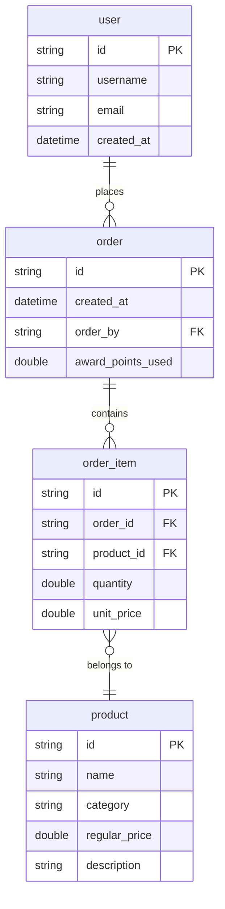

# Sample ERD Diagram

This is a small sample ERD diagram for the ESG Mobile database, focusing on key e-commerce entities.

```mermaid
erDiagram
    user {
        string id PK
        string username
        string email
        datetime created_at
    }

    product {
        string id PK
        string name
        string category
        double regular_price
        string description
    }

    order {
        string id PK
        datetime created_at
        string order_by FK
        double award_points_used
    }

    order_item {
        string id PK
        string order_id FK
        string product_id FK
        double quantity
        double unit_price
    }

    user ||--o{ order : places
    order ||--o{ order_item : contains
    order_item }o--|| product : "belongs to"
```
